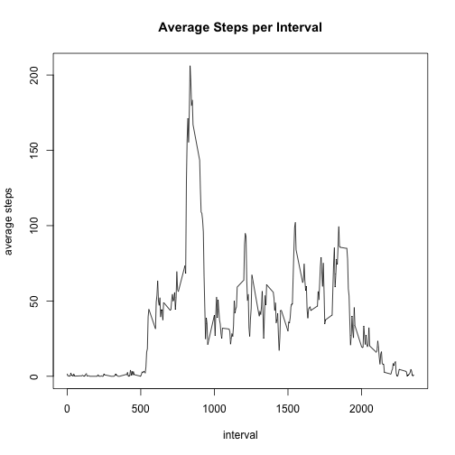

## Loading and preprocessing the data


```r
library(dplyr)
```


```r
unzip('activity.zip')
dt = read.csv('activity.csv')
```


## What is mean total number of steps taken per day?

Restrict to only rows with numbers

```r
dtNums <- dt[!is.na(dt['steps']),]
dtSumSteps <- dtNums %>% group_by(date) %>% summarise(steps = sum(steps)) 
hist(dtSumSteps$steps, xlab='Daily Steps Taken', main="Distribution of Daily Steps Taken", breaks = 20)
```


```r
meanSteps <- mean(dtSumSteps$steps)
medianSteps <- median(dtSumSteps$steps)
```

The mean number of steps is 1.0766189 &times; 10<sup>4</sup> and the median number of steps is 10765.

## What is the average daily activity pattern?

The following plots the average steps per interval for the dataset.


```r
dtAvInterval <- dtNums %>% group_by(interval) %>% summarise(steps = mean(steps)) 
plot(dtAvInterval$interval, dtAvInterval$steps, type="l", xlab='interval', 
     ylab='average steps', main='Average Steps per Interval')
```



```r
maxInterval <-dtAvInterval[104,'interval']
```

The interval with most steps on average is 835.


## Imputing missing values

The total number of rows with missing values is below.

```r
sum(!complete.cases(dt))
```

```
## [1] 2304
```

Set any missing values to be the overall mean number of steps. 


```r
dtNa = dt[is.na(dt$steps),]
dtNa$steps <- round(mean(dtNums$steps))
dt2 = rbind(dtNums, dtNa)

dtSumSteps2 <- dt2 %>% group_by(date) %>% summarise(steps = sum(steps)) 
hist(dtSumSteps2$steps, xlab='Daily Steps Taken', main="Distribution of Daily Steps Taken Imputed", 
     breaks = 20)
```


```r
meanSteps2 <- mean(dtSumSteps2$steps)
medianSteps2 <-median(dtSumSteps2$steps)
```


Per the distribution and mean / median there is not much difference to dataset without imputed values. The mean number of steps is 10751.74 as compared to 10766.19 and the median number of steps is 10656 as compared to 10765.


## Are there differences in activity patterns between weekdays and weekends?


```r
library(lattice)
dt2$weekday <- weekdays(as.Date(dt2$date))
dt2$dayType <- ifelse(dt2$weekday == 'Sunday' | dt2$weekday == 'Saturday', 'weekend', 'weekday')
dtAvWeekday <- dt2 %>% group_by(interval,dayType) %>% summarise(steps = mean(steps)) 
xyplot(steps ~ interval|dayType, data=dtAvWeekday, type="l", layout=c(1,2))
```


Based on the above graph there are differences in activity patterns.
